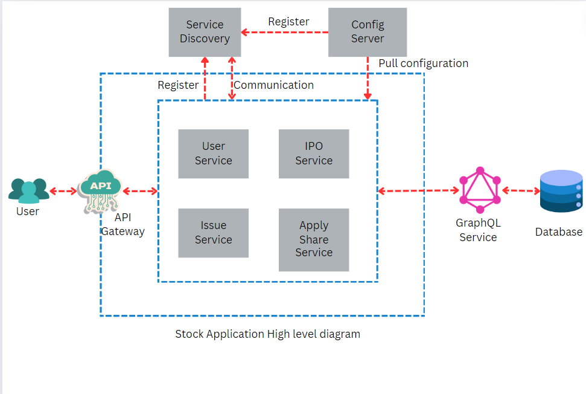

# stock
Stock Application

## Installation and Run the application
  -  Run the following code on gitbash to clone the project
    
     `git clone https://github.com/suraz-f1soft/stock.git`

  -  Run the application
    
     ### Spring-boot Application
       
     - Open the stock folder and run the following commands

      - Service Discovery
        ```bash
        cd service-discovery
        ```
        ```bash
        
        mvn spring-boot:run

        ```

      - Service Config
        ```bash
        cd service-config
        ```
        ```bash

        mvn spring-boot:run

        ```

      - Gateway
        ```bash
        cd gateway
        ```
        ```bash

        mvn spring-boot:run

        ```

      - GraphQl
        ```bash
        cd graphql-server
        ```
        ```bash

        mvn spring-boot:run
        
        ```

      - Current Issues
        ```bash
        cd current-issue-service
        ```
        ```bash

        mvn spring-boot:run

        ```

      - IPO result
        ```bash
        cd ipo-result-service
        ```
        ```bash

        mvn spring-boot:run

        ```

      - Share Apply
        ```bash
        cd share-apply-service
        ```
        ```bash

        mvn spring-boot:run

        ```

      - User Service
        ```bash
        cd user-service
        ```
        ```bash

        mvn spring-boot:run

        ```

     ### Angular Application

     - Admin Web
        ```bash
        cd admin-web
        ```
        ```bash
        npm install
        ```
        ```bash
        ng serve
        ```

     - Client Web
        ```bash
        cd stock-application
        ```
        ```bash
        npm install
        ```
        ```bash
        npm serve --port 4300
        ```

## High Level Diagram of Stock Application


